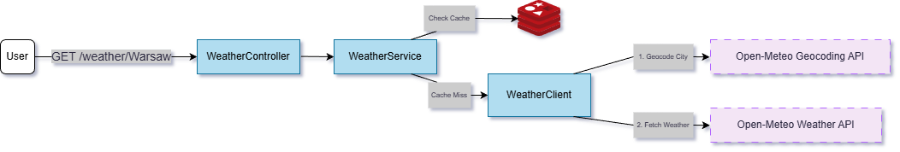

# Weather Checker Service 🌤️

A resilient microservice for real-time weather aggregation, built with **Java 21**, **Spring Boot 3**, and **Redis**.


## 🏗️ Architecture



The service follows a strict separation of concerns to ensure maintainability and testability:
`User` → `Controller` → `Service (w/ Caching)` → `Client` → `Open-Meteo API`

## ✨ Key Features

* **Redis Caching:** Minimizes latency by caching weather data for repeat requests (`@Cacheable`).
* **Resilience:** Implements connection and read timeouts to prevent thread blocking.
* **Geocoding:** Automatically resolves city names (e.g., "Olsztyn") to Lat/Lon coordinates.
* **Production Quality:** Includes Global Exception Handling and input validation.

## 🚀 Quick Start

**Prerequisites:** Java 21, Docker.

1.  **Start Redis:**
    ```bash
    docker run -d --name weather-redis -p 6379:6379 redis
    ```

2.  **Run Application:**
    ```bash
    ./mvnw spring-boot:run
    ```

3.  **Check Weather:**
    ```bash
    curl http://localhost:8080/weather/Warsaw
    ```

## 🧪 Testing Strategy

The project follows the Testing Pyramid:
* **Unit Tests:** Isolated Service logic using `Mockito`.
* **Slice Tests:** Controller validation using `MockMvc`.
* **Client Tests:** External API contracts verified with `MockRestServiceServer` (No real network calls).

Run all tests:
```bash
./mvnw test
```

## 🛠️ Tech Stack

* Core: Java 21 (Records), Spring Boot 3.4
* Communication: Spring RestClient
* Data: Spring Data Redis
* Tools: Docker, Lombok, Maven

